<div align="center">
  
</div>

<div align="center">
  
</div>

<div align="center">

[](https://dimss-market-pulse.streamlit.app/)


</div>

##  About The Project

**Market Pulse** is a comprehensive, bilingual (ID/EN) financial dashboard designed to track crypto, forex, and stock markets alongside U.S. Federal Reserve policy.

Instead of relying on generic templates, this project leans into the visual vocabulary of the financial sector currency green, treasury parchment, gold-seal accents, and a custom hand-drawn sentiment gauge.

**Key highlights:**
- **Transparent AI.** The Fed Wire's Hawkish/Dovish tags use a strict keyword heuristic on release titles, while the Statement Analysis tab leverages a true LLM to score actual FOMC text.
- **Data-driven accuracy.** The historical backtest compares the market's implied predictions (via Fed Funds futures) against real FOMC outcomes, so accuracy is calculated, not asserted.
- **Bilingual interface.** The entire UI switches seamlessly between Indonesian and English with a single click.

## Core Features

**Market Overview**
Live prices for a customizable watchlist. Includes an AI-generated market recap that narrates what already happened today based on price action and Finnhub-powered news headlines, complete with a Bearish↔Bullish sentiment score.

**Federal Reserve & Macro Calendar**
Track the full FOMC meeting schedule (with SEP/dot-plot markers), official BLS release dates for CPI and NFP, and a live RSS wire directly from federalreserve.gov.

**Quantitative Tools**
Explore historical Effective Fed Funds Rate data from FRED, view a 6-month rolling cross-asset correlation heatmap, and run a backtest evaluating how often futures correctly predicted FOMC decisions.

**AI Statement Analysis**
Powered by Llama-3.1 via Groq. Paste any FOMC statement or Fed speech excerpt to receive a -100 to +100 hawkish–dovish score along with a plain-language explanation.

## Tech Stack

| Layer | Tools & Technologies |
| :--- | :--- |
| Frontend | Streamlit, Custom CSS (Fraunces, Inter, IBM Plex Mono) |
| Market Data | Yahoo Finance (Prices, Futures), FRED (Fed Funds Rate) |
| News API | Finnhub |
| Official Sources | federalreserve.gov (Press Releases, RSS), U.S. BLS (CPI/NFP) |
| AI Engine | Groq API (Llama-3.1-8b-instant) |
| Charts | Plotly |

## Project Structure

````text
market-pulse/
├── app.py                   # Main Streamlit entry point
├── assets/
│   └── banner.svg            # Self-hosted animated header banner
├── modules/
│   ├── data.py              # Market snapshot, calendars, FRED, backtest, correlation
│   ├── news.py              # Finnhub news fetch + topic tagging
│   ├── fed_wire.py          # Official Fed RSS feed + keyword lean heuristic
│   ├── ai_analysis.py       # Groq-powered scoring (statement, news, recap)
│   ├── gauge.py             # Theme-aware SVG sentiment gauge
│   └── styling.py           # Theme palettes + injected CSS
├── .streamlit/config.toml   # Streamlit theme config
├── requirements.txt
├── .env.example
└── README.md
````

## Getting Started

**Prerequisites:** Python 3.9+, a free Groq API key (for AI features), a free Finnhub API key (for the news feed).

**1. Clone the repository**
````bash
git clone https://github.com/dimssrmdn01/market-pulse.git
cd market-pulse
````

**2. Set up the environment**
````bash
python -m venv venv
source venv/bin/activate   # On Windows use: venv\Scripts\activate
pip install -r requirements.txt
````

**3. Configure API keys**

Create a `.env` file in the root directory and add your keys:
````
GROQ_API_KEY=gsk_...
FINNHUB_API_KEY=...
````

**4. Run the application**
````bash
streamlit run app.py
````

The ticker, calendars, Fed Wire, rate history, and backtest all work with zero API keys. Only the news feed and AI-powered tabs require them.

## Deployment

To deploy this project for free on Streamlit Community Cloud:
1. Push this repository to your own GitHub account.
2. Link the repository and select `app.py` as the main file.
3. Go to Advanced settings → Secrets and add your API keys in TOML format.

## Disclaimer

This is an educational and portfolio project. Market data, backtest results, and AI-generated scores are indicative estimates, not investment advice. Always verify official policy decisions and economic releases at federalreserve.gov and bls.gov.

## Author

Built by **Dimas Arya Ramadhan** - Undergraduate Data Science student at ITERA.

What started as a single-purpose FOMC tracker has grown into a comprehensive bilingual dashboard featuring live news, official Fed wires, quantitative backtesting, and cross-asset correlation analysis.
